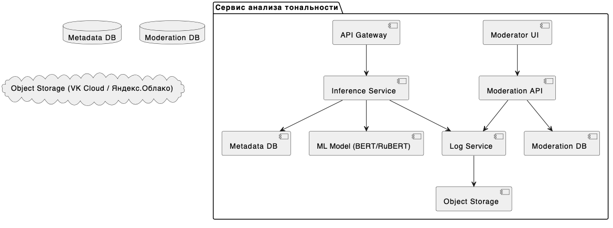
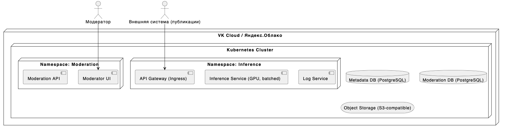

# Кейс №1: Анализ тональности комментариев в соцсети  
## Команда проекта
- **Бердичевский А.С.** — Product Owner, Data Scientist  
- **Захаркин Б.В.** — Data Engineer, Software Architect  

---

## 1. Цели и предпосылки

### 1.1 Зачем идем в разработку?
- Автоматизация определения тональности комментариев (позитив, нейтраль, негатив).
- Снижение затрат на ручную модерацию.
- Повышение охвата (100% против текущих <1%).
- Снижение юридических рисков (требования РКН).

### 1.2 Бизнес-требования и ограничения

**Функциональные требования:**
- Обработка 500,000+ комментариев/день.
- Интеграция с системой публикаций и модерации.
- Интерфейс модератора.

**Нефункциональные требования:**
- Latency < 1 секунда.
- SLA: 99.9%.
- Масштабируемость.

### 1.3 Пилот

- Оценка качества модели на 50k размеченных комментариев.
- Метрики: F1-score > 0.85 (негатив), latency < 1 сек.

### 1.4 MVP и технический долг

**MVP включает:**
- Модель классификации на базе BERT.
- REST API.
- Логирование.

**Технический долг:**
- Мультиязычность.
- Расширение классов (hate speech, спам и т.п.).
- Поддержка активного обучения.

---

## 2. Методология

### 2.1 Постановка задачи
- Тип задачи: многоклассовая классификация (тональность).
- Дополнительно: бинарная метка "опасный контент".

### 2.2 Данные
- Источник: исторические комментарии, разметка модераторов.
- Целевая переменная: 3 класса (негатив / нейтраль / позитив).

### 2.3 Модель
- Бейзлайн: Logistic Regression на TF-IDF.
- MVP: BERT / RuBERT.
- Метрики: F1, ROC AUC, Accuracy.

### 2.4 Риски
- Низкое качество разметки.
- Ирония, сарказм, сленг.
- Сильный class imbalance.

---

## 3. Подготовка пилота

### 3.1 Оценка пилота
- Тестирование на исторической выборке.
- Сравнение с ручной модерацией.

### 3.2 Успех пилота
- F1-score (негатив) > 0.85.
- Latency < 1 сек.
- Снижение числа жалоб на 25%.

---

## 4. Production

### 4.1 Архитектура решения

  

### 4.2 Инфраструктура и масштабируемость
- Облако: VK Cloud / Яндекс.Облако.
- Контейнеризация: Kubernetes.
- Инференс: GPU (T4), batched processing.

### 4.3 Требования к работе
- SLA: 99.9%.
- RPS: до 10 req/s.
- Latency: < 1 секунда.

### 4.4 Риски
- Изменение пользовательского языка.
- Сложности интерпретации результатов.
- Давление со стороны регуляторов.

---

## 5. Диаграммы

### 5.1 BPMN-диаграммы бизнес-процессов

- До внедрения: 
- После внедрения: 

### 5.2 ER-диаграмма

### 5.3 Архитектура (логическая и физическая)

- [architecture_components.puml](diagrams/architecture_components.puml)
- [architecture_deployment.puml](diagrams/architecture_deployment.puml)

### 5.4 UML: компоненты и классы

- Компоненты: 
- Классы: 

### 5.5 UML: поведение (прецеденты/активности)

- Use-case: 
- Activity (модерация): 

---

## 6. Ссылки

- GitHub-репозиторий проекта: [ссылка]
- Видео презентации: [ссылка на YouTube / Google Drive]

---

> _Дата защиты: 31 мая 2025._  
> _Команда обязана быть онлайн в момент защиты или предоставить видеозапись._

